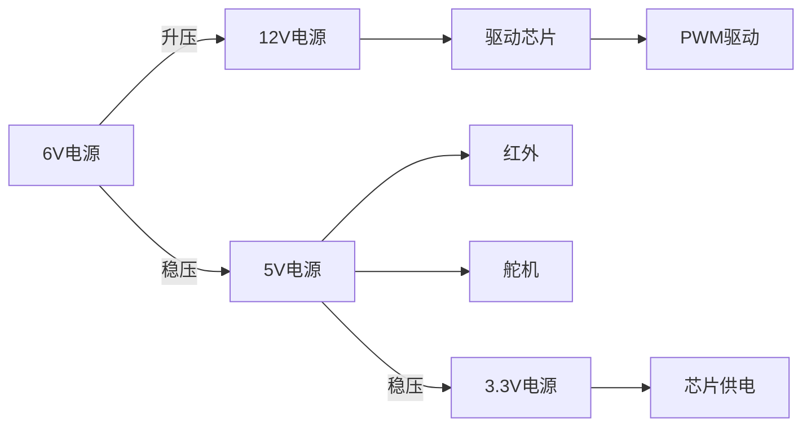

# JMU_ETA_Fly on The Sea
[test]
## 介绍
2019集大电协 海洋航行器

## Altium Design
- [x] 一体化红外接收盘
- [x]  船舶主控板
- 端口定义

功能     | 端口
-------- | -----
红外盘接收  |A8.B13.B14.B15.C6.C7.C8.C9
蓝牙&串口  | USART2_TX -- A2  . USART2_RX -- A3
蓝牙&串口  | USART1_TX -- A9  . USART1_RX -- A10
舵机  | TIM2_CH2 -- A1
电机|TIM3_CH1 --B4 .   TIM3_CH2 -- B5
OLED|DC -- B6. RES -- B7 . D1 -- B8 . D0 -- B9

## Keil

